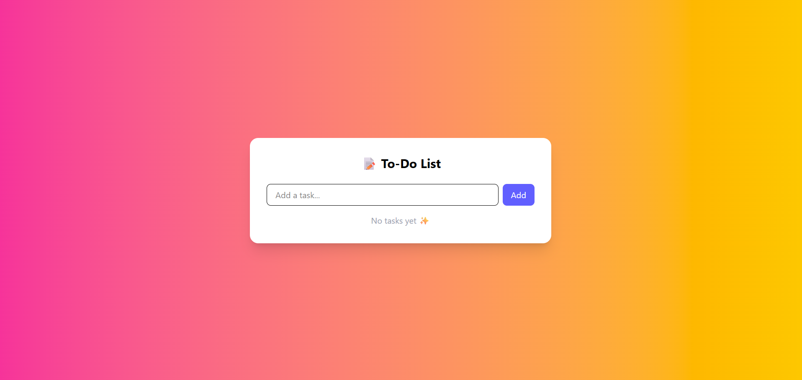

# React + Tailwind CSS To-Do App

A responsive To-Do application built with **React** and **Tailwind CSS**.  
This is a learning project where I am applying Tailwind utilities and React concepts to build functional UI components.

---

## Screenshots



---

## Features

- Add, complete, and delete tasks
- Persistent tasks with localStorage
- Responsive design (mobile, tablet, desktop)
- Gradient background and clean UI
- Built with React and styled with Tailwind CSS

---

## How to Run Locally

Follow these steps to run this project on your machine:

1. **Clone the repository**:

```bash
git clone https://github.com/<username>/<repo>.git
